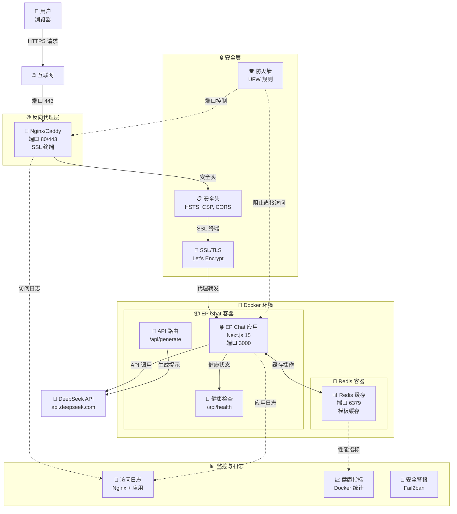
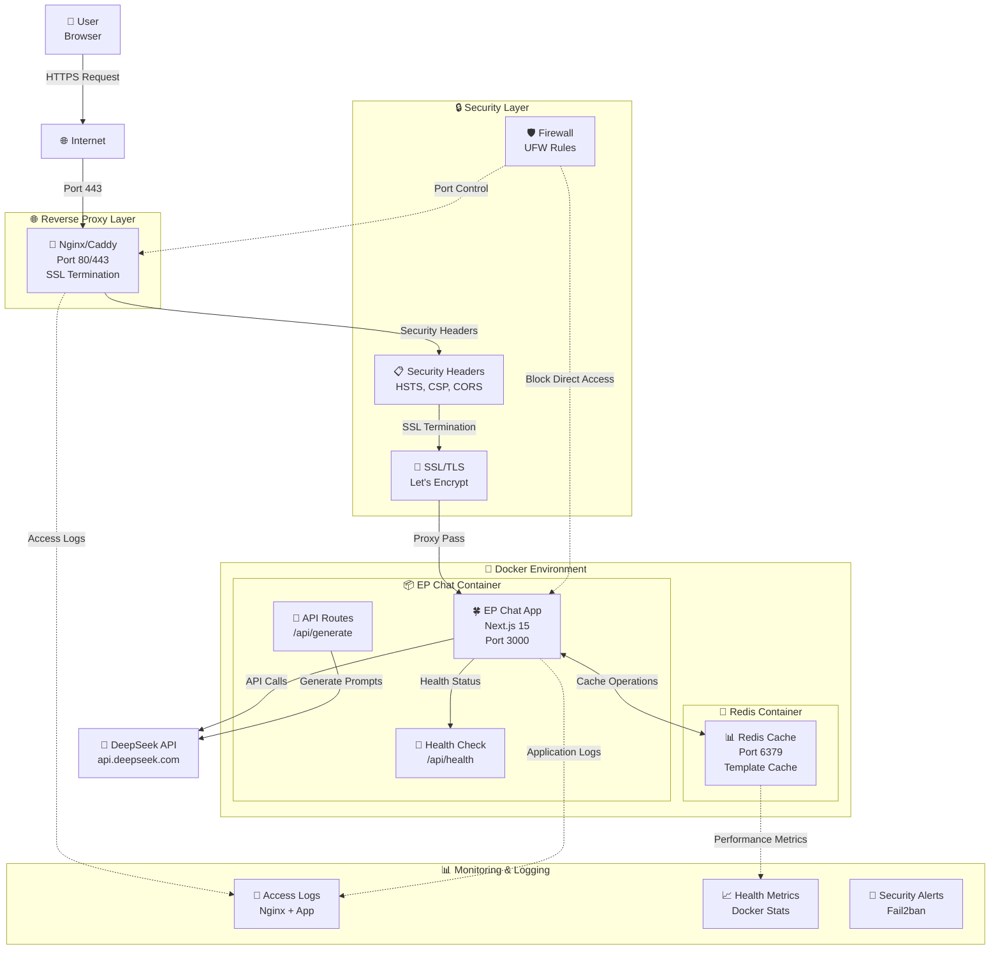

# EP Chat - Enhanced Prompt | 增强提示生成器

<div align="center">

🍀 **超轻量级、超快速的提示增强 Web 应用**

<!-- Technology Stack -->
[](https://nextjs.org/)
[](https://www.typescriptlang.org/)
[](https://tailwindcss.com/)
[](https://platform.deepseek.com/)

<!-- Build & Quality -->
[](https://github.com/sarahaleo88/EP-Chat/actions)
[](https://github.com/sarahaleo88/EP-Chat/actions)
[](https://nodejs.org/)

<!-- Security & Compliance -->
[](./SECURITY.md)
[](./docs/SECURITY_BASELINE.md)
[](https://github.com/sarahaleo88/EP-Chat/security/advisories)
[](https://github.com/sarahaleo88/EP-Chat/network/dependencies)
[](https://github.com/sarahaleo88/EP-Chat/actions)

<!-- License & Docker -->
[](./LICENSE)
[](https://www.docker.com/)

[English](#english) | [中文](#中文)

</div>

---

## 中文

### 🎯 项目概述

EP (Enhanced Prompt) 是一个专为 Claude Code 设计的超轻量级提示增强工具，能够将自然语言需求转换为结构化提示，帮助 Claude Code 一次性生成完整的项目代码。

**核心场景：**

- 🛠️ **代码工具** - 生成工具库、实用程序和代码组件
- 🌐 **Web 应用** - 生成完整的 Web 应用和前端组件

**核心特性：**

- ⚡ 超快响应（无历史记录，无文件上传，流式 SSR）
- 🧩 可扩展模板系统（JSON 模板库 + 渲染器）
- 🔒 仅依赖 **DeepSeek API**（chat|coder|reasoner 模型）
- 🍀 统一四叶草图标主题（favicon/loading/UI）
- 🌐 双语支持（中文/英文）
- 📱 **移动端完美适配**（Android/iOS 全面优化）
- ⚡ **长文本处理优化**（智能超时管理 + 流式响应）

### 🛠 技术栈

| 层级     | 技术选择                                       |
| -------- | ---------------------------------------------- |
| 前端     | **Next.js 15** (App Router / SSR & SSG)        |
| UI 框架  | **React 18 + TypeScript 5 + Tailwind CSS 3**   |
| 状态管理 | React Context (轻量级)                         |
| 样式     | Tailwind + Headless UI                         |
| API 集成 | `lib/deepseek.ts` (单一适配层)                 |
| 构建     | Next.js 原生 turbo 编译                        |
| 部署     | 多阶段 **Dockerfile** + **docker-compose.yml** |
| 测试     | Vitest + React Testing Library                 |

### 🚀 快速开始

#### 0. 系统要求

- **Node.js**: 18.0 或更高版本
- **npm**: 8.0 或更高版本
- **Docker**: (可选) 用于容器化部署
- **curl**: 用于健康检查

#### 1. 环境准备

```bash
# 克隆项目
git clone https://github.com/sarahaleo88/EP-Chat.git
cd EP-Chat

# 安装依赖
npm install

# 配置环境变量（选择其一）
# 方式1: 最小配置（推荐新手）
cp .env.minimal.example .env

# 方式2: 完整配置（包含所有选项）
cp .env.example .env

# 编辑 .env 文件，填入你的 DeepSeek API Key
```

#### 2. 环境变量配置

##### 🔧 基础配置步骤

1. **复制环境变量模板**
   ```bash
   # 完整配置（推荐）
   cp .env.example .env
   ```

2. **获取 DeepSeek API Key**
   - 访问 [DeepSeek Platform](https://platform.deepseek.com/api_keys)
   - 注册账户并创建 API Key
   - 复制生成的 API Key

3. **配置必需变量**
   ```env
   # 🔑 必需配置
   DEEPSEEK_API_KEY=your_deepseek_api_key_here
   NODE_ENV=production
   NEXT_PUBLIC_APP_URL=http://localhost:3000
   ```

##### 🔒 安全配置指南

**API Key 安全管理：**
- ❌ **绝不要**将 `.env` 文件提交到版本控制
- ✅ 使用环境变量或安全的密钥管理服务
- ✅ 定期轮换 API Key
- ✅ 为不同环境使用不同的 API Key

**生产环境安全设置：**
```env
# 🔒 生产安全配置
NODE_ENV=production
NEXT_TELEMETRY_DISABLED=1
CORS_ORIGINS=https://yourdomain.com
RATE_LIMIT_PER_MINUTE=30
ENABLE_REQUEST_LOGGING=true
```

##### 📊 可选配置

**Redis 缓存（提升性能）：**
```env
# 📊 缓存配置
REDIS_URL=redis://localhost:6379
REDIS_PASSWORD=your_secure_redis_password
ENABLE_TEMPLATE_CACHE=true
TEMPLATE_CACHE_TTL=3600
```

**性能优化：**
```env
# 🚀 性能配置
API_TIMEOUT=30000
MAX_CONCURRENT_REQUESTS=10
ENABLE_PERFORMANCE_MONITORING=true

# 长文本生成超时配置
STREAMING_TIMEOUT=300000        # 流式响应超时 (5分钟)
CHUNK_INTERVAL_TIMEOUT=30000    # 数据块间隔超时 (30秒)
CONTINUATION_TIMEOUT=180000     # 续写段超时 (3分钟)
EP_LONG_OUTPUT_GUARD=on         # 启用长文本保护
```

##### ✅ 配置验证

**验证环境配置：**
```bash
# 检查必需变量
node -e "
const requiredVars = ['DEEPSEEK_API_KEY', 'NODE_ENV'];
const missing = requiredVars.filter(v => !process.env[v]);
if (missing.length) {
  console.error('❌ 缺少必需环境变量:', missing.join(', '));
  process.exit(1);
} else {
  console.log('✅ 环境变量配置正确');
}
"

# 测试 API 连接
curl -H "Authorization: Bearer $DEEPSEEK_API_KEY" \
     https://api.deepseek.com/v1/models
```

#### 3. 本地开发

```bash
# 启动开发服务器
npm run dev

# 访问应用
open http://localhost:3000

# 验证安装
curl http://localhost:3000
```

#### 4. Docker 部署

```bash
# 构建并启动
docker compose up -d

# 查看状态
docker compose ps

# 查看日志
docker compose logs -f

# 停止服务
docker compose down
```

应用将在 `http://localhost:3000` 可用。

##### Docker 架构

EP Chat 应用使用 **3 阶段优化 Docker 构建** 实现高效容器化：

1. **依赖阶段**：安装生产依赖
2. **构建阶段**：编译 TypeScript 并构建 Next.js 应用（standalone 模式）
3. **运行阶段**：最终优化镜像，包含安全加固和健康检查

##### 多阶段构建优势

- **构建成功**：编译期间所有依赖可用
- **优化大小**：最终镜像仅包含生产依赖（~703MB）
- **安全性**：非 root 用户，适当的文件权限
- **健康监控**：内置健康检查，支持容器编排

##### 关键特性

- ✅ **模块解析**：正确处理 TypeScript 路径映射和工具导入
- ✅ **依赖管理**：分离构建时和运行时依赖
- ✅ **安全加固**：非 root 用户（nextjs:nodejs），最小权限
- ✅ **健康检查**：HTTP 端点监控容器健康状态
- ✅ **生产就绪**：优化部署，适当的环境配置

##### 🤖 自动化部署

**使用 Makefile（推荐）：**
```bash
# 查看所有可用命令
make help

# 完整部署流程
make deploy          # 检查环境 → 构建 → 启动

# 常用操作
make build          # 构建镜像
make up             # 启动服务
make down           # 停止服务
make logs           # 查看日志
make restart        # 重启服务
make clean          # 清理资源

# 开发工作流
make dev            # 构建 → 启动 → 显示日志

# 健康检查
make health         # 检查应用健康状态
make status         # 查看服务状态
```

**手动 Docker 命令：**
```bash
# 传统方式（如果不使用 Makefile）
docker compose build --no-cache
docker compose up -d
docker compose logs -f
```

##### Docker 文档

- 📖 [Docker 部署故障排除指南](./docs/DOCKER_DEPLOYMENT_TROUBLESHOOTING.md) - 详细的问题诊断和解决方案
- 🚀 [Docker 快速参考](./docs/DOCKER_QUICK_REFERENCE.md) - 常用命令和操作指南
- 🌐 [Nginx 配置指南](./docs/NGINX_CONFIGURATION.md) - 生产环境反向代理配置
- 🔧 [Caddy 配置指南](./docs/CADDY_CONFIGURATION.md) - 自动 SSL 反向代理配置
- 📱 [移动端使用指南](./docs/MOBILE_GUIDE.md) - 移动设备优化和使用说明

#### 5. 版本管理与升级

##### 🔄 升级指南

**自动升级（推荐）：**
```bash
# 使用 Makefile 自动升级
make update          # 自动备份 → 拉取更新 → 重新构建 → 重启

# 检查升级后状态
make health          # 验证应用健康状态
make test            # 运行基础功能测试
```

**手动升级步骤：**
```bash
# 1. 创建备份
make backup          # 或手动备份
cp .env .env.backup
cp docker-compose.yml docker-compose.yml.backup

# 2. 停止服务
make down

# 3. 拉取最新代码
git pull origin main

# 4. 检查更新内容
git log --oneline -10
git diff HEAD~1 docker-compose.yml  # 检查配置变更

# 5. 重新构建和启动
make build
make up

# 6. 验证升级
make health
make test
```

##### 🔙 回滚程序

**快速回滚：**
```bash
# 回滚到上一个版本
git reset --hard HEAD~1
make build
make up

# 恢复配置文件
cp .env.backup .env
cp docker-compose.yml.backup docker-compose.yml
make restart
```

**完整回滚：**
```bash
# 1. 停止当前服务
make down

# 2. 回滚到特定版本
git log --oneline -10  # 查看版本历史
git reset --hard <commit-hash>

# 3. 恢复备份配置
cp .env.backup .env

# 4. 重新部署
make deploy

# 5. 验证回滚
make health
```

##### 📋 版本兼容性

**当前版本**: EP-Chat v1.3.0 (2025-12-06)

| EP Chat 版本 | Node.js | Docker | Docker Compose | 支持状态 |
|-------------|---------|--------|----------------|----------|
| v1.3.x      | 18.x+   | 20.x+  | 2.x+          | ✅ 当前版本 |
| v1.2.x      | 18.x+   | 20.x+  | 2.x+          | ⚠️ 安全更新 |
| v1.1.x      | 18.x+   | 20.x+  | 2.x+          | ⚠️ 安全更新 |
| v1.0.x      | 16.x+   | 19.x+  | 1.29+         | ❌ 不再支持 |

##### ⚠️ 重大变更提醒

**升级前必读：**
- 📖 查看 [CHANGELOG.md](./CHANGELOG.md) 了解重大变更
- 🔍 检查环境变量是否有新增或变更
- 🧪 在测试环境先验证升级流程
- 💾 确保已创建完整备份

**常见升级问题：**
- **环境变量变更**：检查 `.env.example` 是否有新变量
- **Docker 配置更新**：对比 `docker-compose.yml` 变更
- **依赖版本冲突**：使用 `make clean-all` 清理后重建

#### 6. 常见问题解决

##### 🚨 端口冲突

**问题症状：**
- 启动失败，提示端口被占用
- `Error: listen EADDRINUSE :::3000`

**诊断命令：**
```bash
# 检查端口占用
netstat -tulpn | grep :3000
lsof -i :3000

# 检查 Docker 端口
docker ps --format "table {{.Names}}\t{{.Ports}}"
```

**解决方案：**
```bash
# 方案1：停止占用端口的进程
sudo kill -9 $(lsof -t -i:3000)

# 方案2：修改应用端口
# 在 .env 文件中添加：
# PORT=3001

# 方案3：停止冲突的 Docker 容器
docker ps | grep 3000
docker stop <container_name>
```

##### 🐳 Docker 构建失败

**问题症状：**
- 构建过程中断
- 模块解析错误
- 内存不足错误

**诊断命令：**
```bash
# 检查 Docker 状态
docker system df
docker system info

# 检查构建日志
make build 2>&1 | tee build.log
```

**解决方案：**
```bash
# 清理 Docker 缓存
make clean-all

# 增加 Docker 内存限制
# Docker Desktop: Settings → Resources → Memory (推荐 4GB+)

# 分步构建排查
docker compose build --no-cache --progress=plain

# 检查磁盘空间
df -h
docker system prune -a
```

##### 💾 内存/磁盘空间不足

**问题症状：**
- 构建过程中止
- 应用运行缓慢
- 容器重启频繁

**诊断命令：**
```bash
# 检查系统资源
free -h                    # 内存使用
df -h                      # 磁盘空间
docker stats               # 容器资源使用

# 检查 Docker 资源
docker system df -v        # Docker 空间使用详情
```

**解决方案：**
```bash
# 清理系统资源
make clean                 # 清理 Docker 资源
docker system prune -a     # 深度清理

# 优化内存使用
# 在 docker-compose.yml 中添加内存限制：
# deploy:
#   resources:
#     limits:
#       memory: 512M

# 清理日志文件
docker logs ep-enhanced-prompt --tail=100  # 查看最近日志
# 然后清理旧日志
```

##### 🔑 权限错误

**问题症状：**
- 文件访问被拒绝
- Docker 权限错误
- 无法写入配置文件

**诊断命令：**
```bash
# 检查文件权限
ls -la .env
ls -la docker-compose.yml

# 检查 Docker 权限
docker info | grep -i error
groups $USER | grep docker
```

**解决方案：**
```bash
# 修复文件权限
chmod 644 .env
chmod 644 docker-compose.yml

# 添加用户到 Docker 组
sudo usermod -aG docker $USER
# 重新登录或执行：
newgrp docker

# 修复 Docker socket 权限
sudo chmod 666 /var/run/docker.sock
```

##### 🌐 网络连接问题

**问题症状：**
- API 请求超时
- 无法连接到 DeepSeek API
- DNS 解析失败

**诊断命令：**
```bash
# 测试网络连接
curl -I https://api.deepseek.com/v1/models
ping api.deepseek.com

# 检查防火墙
sudo ufw status
iptables -L

# 测试容器网络
docker network ls
docker network inspect ep_default
```

**解决方案：**
```bash
# 检查 API 密钥
echo $DEEPSEEK_API_KEY | head -c 20  # 显示前20个字符

# 配置代理（如需要）
# 在 .env 中添加：
# HTTP_PROXY=http://proxy.company.com:8080
# HTTPS_PROXY=http://proxy.company.com:8080

# 重启网络服务
sudo systemctl restart docker
make restart
```

##### 📋 快速诊断清单

**系统健康检查：**
```bash
# 一键诊断脚本
make health              # 应用健康检查
make status              # 服务状态
docker system info      # Docker 系统信息
df -h                    # 磁盘空间
free -h                  # 内存使用
```

**详细故障排除：**
- 📖 [Docker 部署故障排除](./docs/DOCKER_DEPLOYMENT_TROUBLESHOOTING.md)
- 🌐 [反向代理故障排除](./docs/REVERSE_PROXY_TROUBLESHOOTING.md)
- 🔧 [Docker 快速参考](./docs/DOCKER_QUICK_REFERENCE.md)

#### 7. 安全最佳实践

##### 🔒 生产部署安全清单

**⚠️ 关键安全警告：**

> **🚨 绝不要将 `.env` 文件提交到版本控制系统**
> API 密钥和敏感配置一旦泄露将导致严重安全风险

> **🔐 定期轮换 API 密钥**
> 建议每 90 天更换一次 DeepSeek API 密钥

> **🛡️ 使用 HTTPS 部署**
> 生产环境必须使用 SSL/TLS 加密，参考 [Nginx 配置](./docs/NGINX_CONFIGURATION.md)

**生产部署前检查：**
```bash
# 1. 验证环境变量安全性
grep -r "your_.*_key_here" .env && echo "❌ 发现默认密钥，请更换" || echo "✅ 密钥已配置"

# 2. 检查文件权限
ls -la .env | grep -q "rw-------" && echo "✅ .env 权限安全" || echo "⚠️ 建议设置 .env 权限为 600"

# 3. 验证 HTTPS 配置
curl -I https://yourdomain.com | grep -q "Strict-Transport-Security" && echo "✅ HTTPS 安全头已配置" || echo "⚠️ 缺少安全头配置"

# 4. 检查容器安全
docker inspect ep-enhanced-prompt | grep -q '"User": "nextjs"' && echo "✅ 非 root 用户运行" || echo "⚠️ 容器可能以 root 运行"
```

##### 🔐 API 密钥管理

**安全存储方案：**
```bash
# 方案1：环境变量（推荐）
export DEEPSEEK_API_KEY="your_actual_key"
echo 'export DEEPSEEK_API_KEY="your_actual_key"' >> ~/.bashrc

# 方案2：Docker Secrets（生产环境）
echo "your_actual_key" | docker secret create deepseek_api_key -
# 在 docker-compose.yml 中引用 secrets

# 方案3：外部密钥管理（企业级）
# 使用 HashiCorp Vault、AWS Secrets Manager 等
```

**密钥轮换流程：**
```bash
# 1. 生成新密钥（在 DeepSeek 平台）
# 2. 更新环境变量
sed -i 's/DEEPSEEK_API_KEY=.*/DEEPSEEK_API_KEY=new_key_here/' .env

# 3. 重启服务
make restart

# 4. 验证新密钥
make health

# 5. 撤销旧密钥（在 DeepSeek 平台）
```

##### 🛡️ 网络安全

**防火墙配置：**
```bash
# 基础防火墙规则
sudo ufw enable
sudo ufw default deny incoming
sudo ufw default allow outgoing

# 允许必要端口
sudo ufw allow 22/tcp    # SSH
sudo ufw allow 80/tcp    # HTTP
sudo ufw allow 443/tcp   # HTTPS

# 限制 Docker 端口访问（仅本地）
sudo ufw deny 3000/tcp
sudo ufw allow from 127.0.0.1 to any port 3000
```

**SSL/TLS 强化：**
```bash
# 检查 SSL 配置强度
curl -I https://yourdomain.com | grep -E "(Strict-Transport-Security|X-Content-Type-Options)"

# 测试 SSL 评级（外部工具）
# 访问：https://www.ssllabs.com/ssltest/analyze.html?d=yourdomain.com
```

##### 📊 安全监控

**日志监控：**
```bash
# 监控访问日志中的异常模式
tail -f /var/log/nginx/ep-chat.access.log | grep -E "(40[0-9]|50[0-9])"

# 监控 Docker 容器日志
docker compose logs -f | grep -i -E "(error|warning|fail)"

# 设置日志轮转
sudo logrotate -f /etc/logrotate.d/ep-chat
```

**安全扫描：**
```bash
# Docker 镜像安全扫描
docker scout cves ep-chat:latest

# 依赖漏洞扫描
npm audit --audit-level high

# 端口扫描检查
nmap -sS -p 1-65535 localhost
```

##### 🔧 安全配置模板

**生产环境 `.env` 模板：**
```env
# 🔑 API 配置
DEEPSEEK_API_KEY=sk-your-actual-key-here
NODE_ENV=production

# 🔒 安全配置
NEXT_TELEMETRY_DISABLED=1
CORS_ORIGINS=https://yourdomain.com
RATE_LIMIT_PER_MINUTE=30
ENABLE_REQUEST_LOGGING=true

# 🛡️ 安全头配置
SECURITY_HEADERS_ENABLED=true
CSP_ENABLED=true
HSTS_MAX_AGE=31536000

# 📊 监控配置
HEALTH_CHECK_ENABLED=true
METRICS_ENABLED=true
LOG_LEVEL=info
```

##### 📋 安全合规检查

**定期安全审计：**
```bash
# 每月执行的安全检查
make security-audit() {
    echo "🔍 执行安全审计..."

    # 1. 检查依赖漏洞
    npm audit --audit-level high

    # 2. 扫描 Docker 镜像
    docker scout cves ep-chat:latest

    # 3. 检查文件权限
    find . -name "*.env*" -exec ls -la {} \;

    # 4. 验证网络配置
    sudo ufw status verbose

    # 5. 检查日志异常
    grep -i -E "(error|fail|attack)" /var/log/nginx/ep-chat.access.log | tail -20

    echo "✅ 安全审计完成"
}
```

**合规文档参考：**
- 🔒 [安全策略](./SECURITY.md) - 漏洞报告和安全联系方式
- 📋 [安全基线](./docs/SECURITY_BASELINE.md) - 详细安全配置要求
- 🛡️ [系统架构](./docs/ARCHITECTURE.md) - 安全架构设计说明

#### 8. 系统架构

##### 🏗️ 架构概览

EP Chat 采用现代化、安全优先的容器化架构，支持生产级部署和横向扩展。



##### 🔌 端口配置

| 端口 | 服务 | 访问权限 | 用途 |
|------|------|----------|------|
| 80 | HTTP | 外部 | 重定向到 HTTPS |
| 443 | HTTPS | 外部 | 主应用访问 |
| 3000 | EP Chat | 内部 | 应用服务器 |
| 6379 | Redis | 内部 | 缓存操作 |

##### 🛡️ 安全边界

- **外部流量** → 仅通过反向代理
- **内部网络隔离** → 容器间通信
- **容器级安全** → 非 root 用户运行
- **API 密钥保护** → 环境变量隔离

详细架构文档：[系统架构设计](./docs/ARCHITECTURE.md)

### 📁 项目结构

```
ep/
├── app/                        # Next.js App Router
│   ├── layout.tsx             # 根布局
│   ├── page.tsx               # 主页面
│   ├── globals.css            # 全局样式
│   ├── api/generate/          # API 路由
│   └── components/            # React 组件
├── lib/                       # 核心库
│   ├── deepseek.ts           # DeepSeek API 客户端
│   ├── template-registry.ts  # 模板注册表
│   ├── prompt-generator.ts   # 提示生成器
│   ├── types.ts              # 类型定义
│   └── utils.ts              # 工具函数
├── templates/                 # JSON 模板库
│   ├── schema.json           # 模板 Schema
│   ├── code/                 # 代码模板
│   └── web/                  # Web 模板
├── tests/                    # 测试文件
├── public/                   # 静态资源
├── Dockerfile               # Docker 配置
├── docker-compose.yml       # Docker Compose
└── README.md               # 项目文档
```

### 🎨 使用方法

1. **选择场景**：代码工具 或 Web 应用
2. **选择模板**：从预定义模板中选择最适合的
3. **选择模型**：Chat（通用）、Coder（代码）、Reasoner（推理）
4. **输入需求**：详细描述你的项目需求
5. **生成提示**：点击生成按钮，获得结构化提示
6. **复制使用**：将生成的提示复制到 Claude Code 中使用

### 📱 PWA 安装指南

EP Chat 支持渐进式 Web 应用 (PWA) 功能，可以像原生应用一样安装到您的设备上。

#### 安装步骤

1. **桌面端 (Chrome/Edge)**: 在地址栏中查找安装图标 (⊕) 并点击
2. **移动端 (Chrome)**: 点击菜单 → "添加到主屏幕"
3. **iOS Safari**: 点击分享 → "添加到主屏幕"

#### 离线支持

- 应用支持离线使用缓存内容
- API 请求采用网络优先策略，网络失败时回退到缓存
- 核心功能在无网络连接时仍可使用

#### PWA 特性

- ✅ 可安装到桌面和移动设备
- ✅ 离线功能支持
- ✅ 原生应用般的体验
- ✅ 自动更新
- ✅ 推送通知就绪（未来功能）

### 🧪 测试

本项目使用 **Vitest** 进行单元测试与组件测试，完整测试套件包含 **51 个测试文件、691 个测试用例**，已全部通过。

```bash
# 运行所有测试
npm test

# 监听模式
npm run test:watch

# 生成覆盖率报告
npx vitest run --coverage

# 运行特定测试文件
npm test -- tests/deepseek.test.ts
```

> 📚 更多测试细节与说明见 [docs/testing.md](./docs/testing.md)

### 🔧 开发

#### 添加新模板

1. 在 `templates/code/` 或 `templates/web/` 中创建 JSON 文件
2. 按照 `templates/schema.json` 定义结构
3. 更新 `lib/template-registry.ts` 中的模板列表

#### 自定义样式

- 主要样式文件：`app/globals.css`
- Tailwind 配置：`tailwind.config.js`
- 四叶草主题色：`--clover-primary: #22c55e`

#### API 扩展

- DeepSeek 客户端：`lib/deepseek.ts`
- API 路由：`app/api/generate/route.ts`
- 类型定义：`lib/types.ts`

### 📊 性能优化

- ✅ 首屏 JS < 50KB (gzipped)
- ✅ 流式响应，实时显示
- ✅ 模板懒加载和缓存
- ✅ 移动端优化
- ✅ SSR + 静态生成

### 🔒 安全特性

- API Key 服务端存储
- 请求频率限制
- 输入内容验证
- XSS 防护
- CSRF 保护

### 🌍 国际化

目前支持：

- 🇨🇳 中文 (zh)
- 🇺🇸 English (en)

### 📝 许可证

MIT License - 详见 [LICENSE](LICENSE) 文件

### 🛠 故障排除

#### 常见问题

1. **端口占用错误**

   ```bash
   Error: listen EADDRINUSE: address already in use :::3000
   ```

   **解决方案**: 更改端口或关闭占用进程

   ```bash
   # 查找占用进程
   lsof -i :3000
   # 或使用其他端口
   PORT=3001 npm run dev
   ```

2. **API Key 无效**

   ```bash
   Error: Invalid API Key
   ```

   **解决方案**: 检查 `.env` 文件中的 `DEEPSEEK_API_KEY` 是否正确

3. **Docker 权限问题**
   ```bash
   permission denied while trying to connect to the Docker daemon
   ```
   **解决方案**: 确保用户在 docker 组中
   ```bash
   sudo usermod -aG docker $USER
   ```

### 🤝 贡献

欢迎提交 Issue 和 Pull Request！

---

## English

### 🎯 Project Overview

EP (Enhanced Prompt) is an ultra-lightweight prompt enhancement tool designed for Claude Code, converting natural language requirements into structured prompts to help Claude Code generate complete project code in one go.

**Core Scenarios:**

- 🛠️ **Code Tools** - Generate utilities, libraries, and code components
- 🌐 **Web Apps** - Generate complete web applications and frontend components

**Key Features:**

- ⚡ Ultra-fast response (no history, no file uploads, streaming SSR)
- 🧩 Extensible template system (JSON template repository + renderer)
- 🔒 Only depends on **DeepSeek API** (chat|coder|reasoner models)
- 🍀 Unified clover leaf icon theme (favicon/loading/UI)
- 🌐 Bilingual support (Chinese/English)
- 📱 Mobile-responsive design

### 🛠 Tech Stack

| Layer            | Technology                                          |
| ---------------- | --------------------------------------------------- |
| Frontend         | **Next.js 15** (App Router / SSR & SSG)             |
| UI Framework     | **React 18 + TypeScript 5 + Tailwind CSS 3**        |
| State Management | React Context (lightweight)                         |
| Styling          | Tailwind + Headless UI                              |
| API Integration  | `lib/deepseek.ts` (single adapter layer)            |
| Build            | Next.js native turbo compilation                    |
| Deployment       | Multi-stage **Dockerfile** + **docker-compose.yml** |
| Testing          | Vitest + React Testing Library                      |

### 🚀 Quick Start

#### 0. Prerequisites

- **Node.js**: 18.0 or higher
- **npm**: 8.0 or higher
- **Docker**: (Optional) for containerized deployment
- **curl**: For health checks

#### 1. Environment Setup

```bash
# Clone the project
git clone https://github.com/sarahaleo88/EP-Chat.git
cd EP-Chat

# Install dependencies
npm install

# Configure environment variables (choose one)
# Option 1: Minimal setup (recommended for beginners)
cp .env.minimal.example .env

# Option 2: Full configuration (includes all options)
cp .env.example .env

# Edit .env file and add your DeepSeek API Key
```

#### 2. Environment Configuration

##### 🔧 Basic Configuration Steps

1. **Copy Environment Template**
   ```bash
   # Full configuration (recommended)
   cp .env.example .env
   ```

2. **Get DeepSeek API Key**
   - Visit [DeepSeek Platform](https://platform.deepseek.com/api_keys)
   - Register and create an API Key
   - Copy the generated API Key

3. **Configure Required Variables**
   ```env
   # 🔑 Required Configuration
   DEEPSEEK_API_KEY=your_deepseek_api_key_here
   NODE_ENV=production
   NEXT_PUBLIC_APP_URL=http://localhost:3000
   ```

##### 🔒 Security Configuration Guide

**API Key Security Management:**
- ❌ **Never** commit `.env` files to version control
- ✅ Use environment variables or secure key management services
- ✅ Rotate API keys regularly
- ✅ Use different API keys for different environments

**Production Security Settings:**
```env
# 🔒 Production Security Configuration
NODE_ENV=production
NEXT_TELEMETRY_DISABLED=1
CORS_ORIGINS=https://yourdomain.com
RATE_LIMIT_PER_MINUTE=30
ENABLE_REQUEST_LOGGING=true
```

##### 📊 Optional Configuration

**Redis Cache (Performance Enhancement):**
```env
# 📊 Cache Configuration
REDIS_URL=redis://localhost:6379
REDIS_PASSWORD=your_secure_redis_password
ENABLE_TEMPLATE_CACHE=true
TEMPLATE_CACHE_TTL=3600
```

**Performance Optimization:**
```env
# 🚀 Performance Configuration
API_TIMEOUT=30000
MAX_CONCURRENT_REQUESTS=10
ENABLE_PERFORMANCE_MONITORING=true
```

##### ✅ Configuration Validation

**Verify Environment Configuration:**
```bash
# Check required variables
node -e "
const requiredVars = ['DEEPSEEK_API_KEY', 'NODE_ENV'];
const missing = requiredVars.filter(v => !process.env[v]);
if (missing.length) {
  console.error('❌ Missing required environment variables:', missing.join(', '));
  process.exit(1);
} else {
  console.log('✅ Environment configuration is correct');
}
"

# Test API connection
curl -H "Authorization: Bearer $DEEPSEEK_API_KEY" \
     https://api.deepseek.com/v1/models
```

#### 3. Local Development

```bash
# Start development server
npm run dev

# Open application
open http://localhost:3000

# Verify installation
curl http://localhost:3000
```

#### 4. Docker Deployment

```bash
# Build and start
docker compose up -d

# Check status
docker compose ps

# View logs
docker compose logs -f

# Stop services
docker compose down
```

The application will be available at `http://localhost:3000`.

##### Docker Architecture

The EP Chat application uses a **3-stage optimized Docker build** for efficient containerization:

1. **Dependencies Stage**: Installs production dependencies
2. **Builder Stage**: Compiles TypeScript and builds the Next.js application (standalone mode)
3. **Runtime Stage**: Final optimized image with security hardening and health checks

##### Multi-Stage Benefits

- **Build Success**: All dependencies available during compilation
- **Optimized Size**: Final image contains only production dependencies (~703MB)
- **Security**: Non-root user with proper file permissions
- **Health Monitoring**: Built-in health checks for container orchestration

##### Key Features

- ✅ **Module Resolution**: Properly handles TypeScript path mappings and utility imports
- ✅ **Dependency Management**: Separates build-time and runtime dependencies
- ✅ **Security Hardening**: Non-root user (nextjs:nodejs) with minimal privileges
- ✅ **Health Checks**: HTTP endpoint monitoring for container health
- ✅ **Production Ready**: Optimized for deployment with proper environment configuration

##### 🤖 Deployment Automation

**Using Makefile (Recommended):**
```bash
# View all available commands
make help

# Complete deployment workflow
make deploy          # Check environment → Build → Start

# Common operations
make build          # Build images
make up             # Start services
make down           # Stop services
make logs           # View logs
make restart        # Restart services
make clean          # Clean up resources

# Development workflow
make dev            # Build → Start → Show logs

# Health checks
make health         # Check application health
make status         # View service status
```

**Manual Docker Commands:**
```bash
# Traditional approach (if not using Makefile)
docker compose build --no-cache
docker compose up -d
docker compose logs -f
```

##### Docker Documentation

- 📖 [Docker Deployment Troubleshooting Guide](./docs/DOCKER_DEPLOYMENT_TROUBLESHOOTING.md) - Detailed problem diagnosis and solutions
- 🚀 [Docker Quick Reference](./docs/DOCKER_QUICK_REFERENCE.md) - Common commands and operation guide
- 🌐 [Nginx Configuration Guide](./docs/NGINX_CONFIGURATION.md) - Production reverse proxy setup
- 🔧 [Caddy Configuration Guide](./docs/CADDY_CONFIGURATION.md) - Automatic SSL reverse proxy setup

#### 5. Version Management and Upgrades

##### 🔄 Upgrade Guide

**Automated Upgrade (Recommended):**
```bash
# Use Makefile for automatic upgrade
make update          # Auto backup → Pull updates → Rebuild → Restart

# Check post-upgrade status
make health          # Verify application health
make test            # Run basic functionality tests
```

**Manual Upgrade Steps:**
```bash
# 1. Create backup
make backup          # Or manual backup
cp .env .env.backup
cp docker-compose.yml docker-compose.yml.backup

# 2. Stop services
make down

# 3. Pull latest code
git pull origin main

# 4. Check update contents
git log --oneline -10
git diff HEAD~1 docker-compose.yml  # Check configuration changes

# 5. Rebuild and start
make build
make up

# 6. Verify upgrade
make health
make test
```

##### 🔙 Rollback Procedures

**Quick Rollback:**
```bash
# Rollback to previous version
git reset --hard HEAD~1
make build
make up

# Restore configuration files
cp .env.backup .env
cp docker-compose.yml.backup docker-compose.yml
make restart
```

**Complete Rollback:**
```bash
# 1. Stop current services
make down

# 2. Rollback to specific version
git log --oneline -10  # View version history
git reset --hard <commit-hash>

# 3. Restore backup configuration
cp .env.backup .env

# 4. Redeploy
make deploy

# 5. Verify rollback
make health
```

##### 📋 Version Compatibility Matrix

**Current Version**: EP-Chat v1.3.0 (2025-12-06)

| EP Chat Version | Node.js | Docker | Docker Compose | Support Status |
|----------------|---------|--------|----------------|----------------|
| v1.3.x         | 18.x+   | 20.x+  | 2.x+          | ✅ Current |
| v1.2.x         | 18.x+   | 20.x+  | 2.x+          | ⚠️ Security Updates |
| v1.1.x         | 18.x+   | 20.x+  | 2.x+          | ⚠️ Security Updates |
| v1.0.x         | 16.x+   | 19.x+  | 1.29+         | ❌ End of Life |

##### ⚠️ Breaking Changes Notice

**Pre-upgrade Checklist:**
- 📖 Review [CHANGELOG.md](./CHANGELOG.md) for breaking changes
- 🔍 Check for new or modified environment variables
- 🧪 Test upgrade process in staging environment first
- 💾 Ensure complete backup is created

**Common Upgrade Issues:**
- **Environment Variable Changes**: Check `.env.example` for new variables
- **Docker Configuration Updates**: Compare `docker-compose.yml` changes
- **Dependency Version Conflicts**: Use `make clean-all` to clean rebuild

#### 6. Common Issues Resolution

##### 🚨 Port Conflicts

**Symptoms:**
- Startup failure with port occupied error
- `Error: listen EADDRINUSE :::3000`

**Diagnostic Commands:**
```bash
# Check port usage
netstat -tulpn | grep :3000
lsof -i :3000

# Check Docker ports
docker ps --format "table {{.Names}}\t{{.Ports}}"
```

**Solutions:**
```bash
# Solution 1: Kill process using the port
sudo kill -9 $(lsof -t -i:3000)

# Solution 2: Change application port
# Add to .env file:
# PORT=3001

# Solution 3: Stop conflicting Docker container
docker ps | grep 3000
docker stop <container_name>
```

##### 🐳 Docker Build Failures

**Symptoms:**
- Build process interruption
- Module resolution errors
- Out of memory errors

**Diagnostic Commands:**
```bash
# Check Docker status
docker system df
docker system info

# Check build logs
make build 2>&1 | tee build.log
```

**Solutions:**
```bash
# Clean Docker cache
make clean-all

# Increase Docker memory limit
# Docker Desktop: Settings → Resources → Memory (recommend 4GB+)

# Step-by-step build troubleshooting
docker compose build --no-cache --progress=plain

# Check disk space
df -h
docker system prune -a
```

##### 💾 Memory/Disk Space Issues

**Symptoms:**
- Build process halts
- Application runs slowly
- Frequent container restarts

**Diagnostic Commands:**
```bash
# Check system resources
free -h                    # Memory usage
df -h                      # Disk space
docker stats               # Container resource usage

# Check Docker resources
docker system df -v        # Docker space usage details
```

**Solutions:**
```bash
# Clean system resources
make clean                 # Clean Docker resources
docker system prune -a     # Deep cleanup

# Optimize memory usage
# Add memory limits in docker-compose.yml:
# deploy:
#   resources:
#     limits:
#       memory: 512M

# Clean log files
docker logs ep-enhanced-prompt --tail=100  # View recent logs
# Then clean old logs
```

##### 🔑 Permission Errors

**Symptoms:**
- File access denied
- Docker permission errors
- Cannot write configuration files

**Diagnostic Commands:**
```bash
# Check file permissions
ls -la .env
ls -la docker-compose.yml

# Check Docker permissions
docker info | grep -i error
groups $USER | grep docker
```

**Solutions:**
```bash
# Fix file permissions
chmod 644 .env
chmod 644 docker-compose.yml

# Add user to Docker group
sudo usermod -aG docker $USER
# Re-login or execute:
newgrp docker

# Fix Docker socket permissions
sudo chmod 666 /var/run/docker.sock
```

##### 🌐 Network Connection Issues

**Symptoms:**
- API request timeouts
- Cannot connect to DeepSeek API
- DNS resolution failures

**Diagnostic Commands:**
```bash
# Test network connectivity
curl -I https://api.deepseek.com/v1/models
ping api.deepseek.com

# Check firewall
sudo ufw status
iptables -L

# Test container network
docker network ls
docker network inspect ep_default
```

**Solutions:**
```bash
# Check API key
echo $DEEPSEEK_API_KEY | head -c 20  # Show first 20 characters

# Configure proxy (if needed)
# Add to .env:
# HTTP_PROXY=http://proxy.company.com:8080
# HTTPS_PROXY=http://proxy.company.com:8080

# Restart network services
sudo systemctl restart docker
make restart
```

##### 📋 Quick Diagnostic Checklist

**System Health Check:**
```bash
# One-click diagnostic script
make health              # Application health check
make status              # Service status
docker system info      # Docker system info
df -h                    # Disk space
free -h                  # Memory usage
```

**Detailed Troubleshooting:**
- 📖 [Docker Deployment Troubleshooting](./docs/DOCKER_DEPLOYMENT_TROUBLESHOOTING.md)
- 🌐 [Reverse Proxy Troubleshooting](./docs/REVERSE_PROXY_TROUBLESHOOTING.md)
- 🔧 [Docker Quick Reference](./docs/DOCKER_QUICK_REFERENCE.md)

#### 7. Security Best Practices

##### 🔒 Production Deployment Security Checklist

**⚠️ Critical Security Warnings:**

> **🚨 Never commit `.env` files to version control**
> API keys and sensitive configuration exposure leads to serious security risks

> **🔐 Rotate API keys regularly**
> Recommend changing DeepSeek API keys every 90 days

> **🛡️ Deploy with HTTPS**
> Production environments must use SSL/TLS encryption, see [Nginx Configuration](./docs/NGINX_CONFIGURATION.md)

**Pre-production Security Check:**
```bash
# 1. Verify environment variable security
grep -r "your_.*_key_here" .env && echo "❌ Default keys found, please replace" || echo "✅ Keys configured"

# 2. Check file permissions
ls -la .env | grep -q "rw-------" && echo "✅ .env permissions secure" || echo "⚠️ Recommend setting .env permissions to 600"

# 3. Verify HTTPS configuration
curl -I https://yourdomain.com | grep -q "Strict-Transport-Security" && echo "✅ HTTPS security headers configured" || echo "⚠️ Missing security headers"

# 4. Check container security
docker inspect ep-enhanced-prompt | grep -q '"User": "nextjs"' && echo "✅ Running as non-root user" || echo "⚠️ Container may be running as root"
```

##### 🔐 API Key Management

**Secure Storage Solutions:**
```bash
# Solution 1: Environment variables (recommended)
export DEEPSEEK_API_KEY="your_actual_key"
echo 'export DEEPSEEK_API_KEY="your_actual_key"' >> ~/.bashrc

# Solution 2: Docker Secrets (production)
echo "your_actual_key" | docker secret create deepseek_api_key -
# Reference secrets in docker-compose.yml

# Solution 3: External key management (enterprise)
# Use HashiCorp Vault, AWS Secrets Manager, etc.
```

**Key Rotation Process:**
```bash
# 1. Generate new key (on DeepSeek platform)
# 2. Update environment variable
sed -i 's/DEEPSEEK_API_KEY=.*/DEEPSEEK_API_KEY=new_key_here/' .env

# 3. Restart services
make restart

# 4. Verify new key
make health

# 5. Revoke old key (on DeepSeek platform)
```

##### 🛡️ Network Security

**Firewall Configuration:**
```bash
# Basic firewall rules
sudo ufw enable
sudo ufw default deny incoming
sudo ufw default allow outgoing

# Allow necessary ports
sudo ufw allow 22/tcp    # SSH
sudo ufw allow 80/tcp    # HTTP
sudo ufw allow 443/tcp   # HTTPS

# Restrict Docker port access (local only)
sudo ufw deny 3000/tcp
sudo ufw allow from 127.0.0.1 to any port 3000
```

**SSL/TLS Hardening:**
```bash
# Check SSL configuration strength
curl -I https://yourdomain.com | grep -E "(Strict-Transport-Security|X-Content-Type-Options)"

# Test SSL rating (external tool)
# Visit: https://www.ssllabs.com/ssltest/analyze.html?d=yourdomain.com
```

##### 📊 Security Monitoring

**Log Monitoring:**
```bash
# Monitor access logs for anomalous patterns
tail -f /var/log/nginx/ep-chat.access.log | grep -E "(40[0-9]|50[0-9])"

# Monitor Docker container logs
docker compose logs -f | grep -i -E "(error|warning|fail)"

# Setup log rotation
sudo logrotate -f /etc/logrotate.d/ep-chat
```

**Security Scanning:**
```bash
# Docker image security scan
docker scout cves ep-chat:latest

# Dependency vulnerability scan
npm audit --audit-level high

# Port scan check
nmap -sS -p 1-65535 localhost
```

##### 🔧 Security Configuration Template

**Production `.env` Template:**
```env
# 🔑 API Configuration
DEEPSEEK_API_KEY=sk-your-actual-key-here
NODE_ENV=production

# 🔒 Security Configuration
NEXT_TELEMETRY_DISABLED=1
CORS_ORIGINS=https://yourdomain.com
RATE_LIMIT_PER_MINUTE=30
ENABLE_REQUEST_LOGGING=true

# 🛡️ Security Headers Configuration
SECURITY_HEADERS_ENABLED=true
CSP_ENABLED=true
HSTS_MAX_AGE=31536000

# 📊 Monitoring Configuration
HEALTH_CHECK_ENABLED=true
METRICS_ENABLED=true
LOG_LEVEL=info
```

##### 📋 Security Compliance Check

**Regular Security Audit:**
```bash
# Monthly security check
make security-audit() {
    echo "🔍 Performing security audit..."

    # 1. Check dependency vulnerabilities
    npm audit --audit-level high

    # 2. Scan Docker image
    docker scout cves ep-chat:latest

    # 3. Check file permissions
    find . -name "*.env*" -exec ls -la {} \;

    # 4. Verify network configuration
    sudo ufw status verbose

    # 5. Check log anomalies
    grep -i -E "(error|fail|attack)" /var/log/nginx/ep-chat.access.log | tail -20

    echo "✅ Security audit completed"
}
```

**Compliance Documentation:**
- 🔒 [Security Policy](./SECURITY.md) - Vulnerability reporting and security contacts
- 📋 [Security Baseline](./docs/SECURITY_BASELINE.md) - Detailed security configuration requirements
- 🛡️ [System Architecture](./docs/ARCHITECTURE.md) - Security architecture design documentation

#### 8. System Architecture

##### 🏗️ Architecture Overview

EP Chat adopts a modern, security-first containerized architecture that supports production-grade deployment and horizontal scaling.



##### 🔌 Port Configuration

| Port | Service | Access | Purpose |
|------|---------|--------|---------|
| 80 | HTTP | External | Redirect to HTTPS |
| 443 | HTTPS | External | Main application access |
| 3000 | EP Chat | Internal | Application server |
| 6379 | Redis | Internal | Cache operations |

##### 🛡️ Security Boundaries

- **External Traffic** → Reverse proxy only
- **Internal Network Isolation** → Container communication
- **Container-level Security** → Non-root user execution
- **API Key Protection** → Environment variable isolation

Detailed Architecture Documentation: [System Architecture Design](./docs/ARCHITECTURE.md)

### 📱 PWA Installation Guide

EP Chat supports Progressive Web App (PWA) functionality, allowing you to install it as a native app on your device.

#### Installation Steps

1. **Desktop (Chrome/Edge)**: Look for the install icon (⊕) in the address bar
2. **Mobile (Chrome)**: Tap the menu → "Add to Home screen"
3. **iOS Safari**: Tap Share → "Add to Home Screen"

#### Offline Support

- The app works offline with cached content
- API requests use network-first strategy with fallback to cache
- Core functionality remains available without internet connection

#### PWA Features

- ✅ Installable on desktop and mobile
- ✅ Offline functionality
- ✅ Native app-like experience
- ✅ Automatic updates
- ✅ Push notifications ready (future feature)

### 🧪 Testing

This project uses **Vitest** for unit and component testing. The complete test suite includes **51 test files and 691 test cases**, all passing.

```bash
# Run all tests
npm test

# Watch mode
npm run test:watch

# Generate coverage report
npx vitest run --coverage

# Run specific test file
npm test -- tests/deepseek.test.ts
```

> 📚 For more testing details, see [docs/testing.md](./docs/testing.md)

### 📊 Performance

- ✅ First-screen JS < 50KB (gzipped)
- ✅ Streaming response with real-time display
- ✅ Template lazy loading and caching
- ✅ Mobile optimization
- ✅ SSR + Static generation
- ✅ PWA-compliant with offline support

### 🔒 Security & Privacy

EP Chat implements comprehensive security measures to protect user data and ensure safe operation:

#### 🛡️ Security Features
- **Zero Data Storage**: No chat history or personal data stored on our servers
- **Client-Side Processing**: API keys stored locally in browser only
- **Direct API Communication**: Requests go directly to DeepSeek servers
- **Input Sanitization**: All user inputs are validated and sanitized
- **XSS Protection**: Built-in protection against cross-site scripting
- **CSRF Protection**: Cross-site request forgery prevention
- **Content Security Policy**: Strict CSP headers for additional security

#### 🔐 Privacy Guarantees
- **No Tracking**: No analytics, cookies, or user tracking
- **No Logging**: Chat conversations are not logged or monitored
- **Local Storage Only**: API keys never leave your device
- **Open Source**: Full transparency with public source code

#### 🚨 Security Monitoring
- **Automated Security Audits**: Daily vulnerability scanning
- **Dependency Monitoring**: Real-time dependency security checks
- **CodeQL Analysis**: Advanced static code analysis
- **Security Badges**: Live security status indicators

#### 📋 Security Compliance
- **OWASP Guidelines**: Following OWASP Top 10 security practices
- **Secure Development**: Security-first development lifecycle
- **Regular Updates**: Prompt security patches and updates
- **Vulnerability Disclosure**: Responsible disclosure program

For detailed security information, see our [Security Policy](./SECURITY.md).
- CSRF protection

### 📝 License

MIT License - see [LICENSE](LICENSE) file for details

### 🛠 Troubleshooting

#### Common Issues

1. **Port already in use error**

   ```bash
   Error: listen EADDRINUSE: address already in use :::3000
   ```

   **Solution**: Change port or kill the process

   ```bash
   # Find the process using the port
   lsof -i :3000
   # Or use a different port
   PORT=3001 npm run dev
   ```

2. **Invalid API Key error**

   ```bash
   Error: Invalid API Key
   ```

   **Solution**: Check your `DEEPSEEK_API_KEY` in the `.env` file

3. **Docker permission issues**
   ```bash
   permission denied while trying to connect to the Docker daemon
   ```
   **Solution**: Ensure your user is in the docker group
   ```bash
   sudo usermod -aG docker $USER
   ```

### 🤝 Contributing

Issues and Pull Requests are welcome!

---

<div align="center">

**Made with 🍀 by EP Team**

</div>
