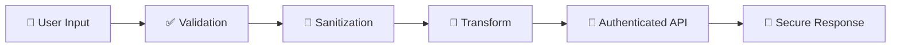
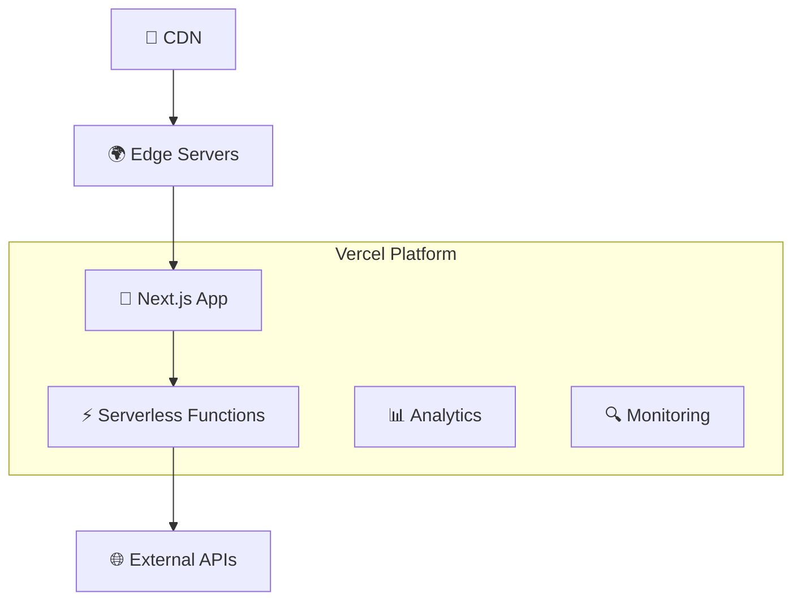

# 🏗️ EP Chat Architecture & Design

This document provides a comprehensive overview of EP Chat's architecture, design decisions, and security considerations.

## 🎯 System Overview

EP Chat is a lightweight, client-side web application for enhancing prompts sent to Claude Code. It follows a simple, secure architecture with minimal attack surface.

```mermaid
graph TB
    User[👤 User] --> Web[🌐 Web Interface]
    Web --> API[⚡ API Routes]
    API --> DeepSeek[🧠 DeepSeek API]
    
    subgraph "Client Side"
        Web --> React[⚛️ React Components]
        React --> State[📊 Local State]
        State --> Cache[💾 Browser Cache]
    end
    
    subgraph "Server Side"
        API --> Validation[✅ Input Validation]
        Validation --> Transform[🔄 Prompt Transform]
        Transform --> Stream[🌊 Response Stream]
    end
    
    subgraph "External Services"
        DeepSeek --> Models[🤖 chat|coder|reasoner]
    end
```

## 🧩 Component Architecture

### Frontend Components

```
app/
├── components/           # React components
│   ├── ui/              # Base UI components
│   ├── ChatInterface    # Main chat interface
│   ├── ModelSelector    # Model selection
│   ├── PromptInput      # Prompt input handling
│   └── PerformanceMonitor # Performance tracking
├── contexts/            # React context providers
├── hooks/               # Custom React hooks
└── pages/               # Next.js pages
```

### Backend Services

```
lib/
├── deepseek-api.ts      # DeepSeek API client
├── prompt-enhancers.ts  # Prompt transformation
├── template-registry.ts # Template management
├── performance-*.ts     # Performance monitoring
└── utils.ts             # Utility functions
```

## 🔒 Security Architecture

### Threat Model

#### Assets
1. **User Prompts**: Sensitive user input requiring confidentiality
2. **API Keys**: DeepSeek API credentials requiring protection
3. **Application Code**: Intellectual property requiring integrity
4. **User Sessions**: Session data requiring availability

#### Threats & Mitigations

| Threat | Risk Level | Mitigation |
|--------|------------|------------|
| **API Key Exposure** | HIGH | Environment variables only, never in client code |
| **Prompt Injection** | MEDIUM | Input validation, length limits, sanitization |
| **XSS Attacks** | MEDIUM | React's built-in XSS protection, CSP headers |
| **CSRF Attacks** | LOW | Stateless API, no cookies, SameSite protection |
| **DoS Attacks** | MEDIUM | Rate limiting, request size limits, timeouts |
| **Data Interception** | LOW | HTTPS-only, secure headers |

#### Security Controls



### Defense in Depth

1. **Input Layer**
   - Length validation (max 50,000 characters)
   - Content type validation
   - Rate limiting per session

2. **Processing Layer**
   - Server-side validation
   - Secure API key handling
   - Request/response sanitization

3. **Output Layer**
   - Content Security Policy (CSP)
   - HTTPS enforcement
   - Secure headers

## 🌊 Data Flow

### Request Flow
1. **User Input** → React component captures user prompt
2. **Validation** → Client-side length and format validation
3. **API Request** → Secure POST to `/api/generate`
4. **Server Processing** → Server validates and enhances prompt
5. **External API** → Authenticated request to DeepSeek API
6. **Streaming Response** → Real-time streaming back to client
7. **UI Update** → React updates with streaming content

### State Management
- **Local State**: React useState for UI state
- **Global State**: React Context for shared state
- **Persistent State**: Browser localStorage for user preferences
- **Cache**: Browser cache for performance optimization

## ⚡ Performance Architecture

### Optimization Strategies

1. **Bundle Optimization**
   - Code splitting with Next.js
   - Tree shaking for unused code
   - Minification and compression

2. **Runtime Optimization**
   - React memoization
   - Debounced user input
   - Efficient re-rendering

3. **Network Optimization**
   - Streaming responses
   - Request deduplication
   - Smart caching

4. **Memory Optimization**
   - Garbage collection friendly
   - Memory leak prevention
   - Efficient data structures

### Performance Metrics
- **Bundle Size**: 128kB first load JS
- **Time to First Byte**: < 500ms
- **Time to First Token**: < 2 seconds
- **Memory Usage**: < 50MB typical

## 🔧 External Interfaces

### DeepSeek API Integration

```typescript
interface DeepSeekRequest {
  model: 'deepseek-chat' | 'deepseek-coder' | 'deepseek-reasoner';
  messages: Array<{ role: string; content: string }>;
  stream: boolean;
  temperature: number;
  max_tokens: number;
}
```

### Security Considerations
- **Authentication**: Bearer token via Authorization header
- **Rate Limiting**: Respect API provider limits
- **Error Handling**: Graceful degradation on API failures
- **Data Privacy**: No user data stored on external services

## 📱 Progressive Web App (PWA)

### PWA Features
- **Service Worker**: Offline functionality and caching
- **Web App Manifest**: Installation and native-like experience
- **Push Notifications**: Future enhancement capability
- **Background Sync**: Offline request queuing

### Offline Strategy
1. **Cache First**: Static assets and UI components
2. **Network First**: Dynamic API responses
3. **Stale While Revalidate**: Template data
4. **Offline Fallback**: Cached responses when network unavailable

## 🔄 Deployment Architecture

### Production Environment



### Infrastructure Security
- **HTTPS Only**: TLS 1.3 encryption
- **Security Headers**: CSP, HSTS, X-Frame-Options
- **Environment Isolation**: Separate dev/staging/production
- **Secret Management**: Vercel environment variables

## 🧪 Testing Architecture

### Test Strategy
1. **Unit Tests**: Component and function testing with Vitest
2. **Integration Tests**: API route testing
3. **E2E Tests**: Critical user flow validation
4. **Security Tests**: Vulnerability scanning
5. **Performance Tests**: Load and stress testing

### Test Coverage Goals
- **Code Coverage**: > 80%
- **Branch Coverage**: > 75%
- **Function Coverage**: > 90%
- **Security Coverage**: 100% of security-critical paths

## 📊 Monitoring & Observability

### Metrics Collection
- **Performance Metrics**: Core Web Vitals, API response times
- **Error Tracking**: Client and server error monitoring
- **Usage Analytics**: Feature usage and user behavior
- **Security Events**: Failed authentication, suspicious activity

### Alerting
- **Error Rate**: > 1% error rate triggers alert
- **Performance**: > 5s response time triggers alert
- **Security**: Any security event triggers immediate alert
- **Availability**: < 99% uptime triggers alert

## 🔮 Future Architecture Considerations

### Scalability Enhancements
1. **Microservices**: Split into focused services if needed
2. **Database Layer**: Add persistent storage for user data
3. **Multi-tenant**: Support for multiple organizations
4. **Real-time Collaboration**: WebSocket-based collaboration

### Security Enhancements
1. **Zero Trust**: Implement zero-trust security model
2. **Advanced Auth**: Add OAuth/SAML support
3. **Audit Logging**: Comprehensive audit trail
4. **Threat Detection**: ML-based anomaly detection

---

**Document Version**: 1.0.0  
**Last Updated**: July 2025  
**Next Review**: October 2025