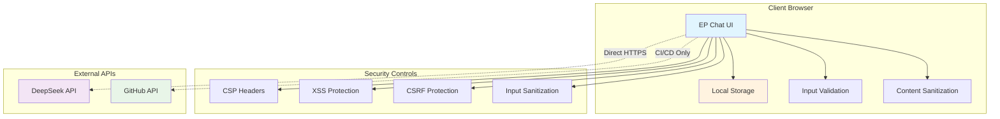

# 🏗️ Security Architecture & Threat Model

This document outlines the security architecture, threat model, and security controls implemented in EP Chat.

## 🎯 Security Architecture Overview

EP Chat follows a **zero-trust, client-side-first** security architecture that minimizes attack surface and eliminates server-side data storage risks.



## 🛡️ Security Principles

### 1. **Zero Data Storage**
- No chat history stored on servers
- No user data persistence
- No server-side session management
- API keys stored locally only

### 2. **Client-Side Security**
- All processing happens in browser
- Direct API communication (no proxy)
- Local storage encryption considerations
- Content Security Policy enforcement

### 3. **Defense in Depth**
- Multiple security layers
- Input validation at multiple points
- Output encoding and sanitization
- Error handling without information disclosure

### 4. **Least Privilege**
- Minimal API permissions
- No unnecessary data access
- Restricted external connections
- Limited browser capabilities usage

## 🎯 Threat Model

### Assets
1. **User API Keys**: DeepSeek API credentials
2. **Chat Content**: User prompts and AI responses
3. **Application Code**: Source code and dependencies
4. **User Privacy**: Personal information and usage patterns

### Threat Actors
1. **Malicious Users**: Attempting to exploit application vulnerabilities
2. **Network Attackers**: Man-in-the-middle attacks
3. **Supply Chain Attacks**: Compromised dependencies
4. **Browser-based Attacks**: XSS, CSRF, clickjacking

### Attack Vectors
1. **Cross-Site Scripting (XSS)**
2. **Cross-Site Request Forgery (CSRF)**
3. **Dependency Vulnerabilities**
4. **API Key Theft**
5. **Network Interception**
6. **Social Engineering**

## 🔒 Security Controls

### Input Validation & Sanitization

```typescript
// Input validation implementation
export const validateInput = (input: string): ValidationResult => {
  const maxLength = 10000;
  const forbiddenPatterns = [
    /<script\b[^<]*(?:(?!<\/script>)<[^<]*)*<\/script>/gi,
    /javascript:/gi,
    /on\w+\s*=/gi
  ];
  
  if (input.length > maxLength) {
    return { valid: false, error: 'Input too long' };
  }
  
  for (const pattern of forbiddenPatterns) {
    if (pattern.test(input)) {
      return { valid: false, error: 'Invalid content detected' };
    }
  }
  
  return { valid: true };
};
```

### Content Security Policy

```typescript
// CSP configuration in next.config.js
const cspHeader = `
  default-src 'self';
  script-src 'self' 'unsafe-eval' 'unsafe-inline';
  style-src 'self' 'unsafe-inline';
  img-src 'self' blob: data: https:;
  font-src 'self';
  connect-src 'self' https://api.deepseek.com;
  object-src 'none';
  base-uri 'self';
  form-action 'self';
  frame-ancestors 'none';
  upgrade-insecure-requests;
`;
```

### API Key Security

```typescript
// Secure API key management
class SecureKeyManager {
  private static readonly STORAGE_KEY = 'ep_api_key';
  
  static store(key: string): void {
    if (typeof window !== 'undefined') {
      // Consider encryption for sensitive environments
      localStorage.setItem(this.STORAGE_KEY, key);
    }
  }
  
  static retrieve(): string | null {
    if (typeof window !== 'undefined') {
      return localStorage.getItem(this.STORAGE_KEY);
    }
    return null;
  }
  
  static clear(): void {
    if (typeof window !== 'undefined') {
      localStorage.removeItem(this.STORAGE_KEY);
    }
  }
}
```

## 🚨 Risk Assessment

| Risk | Likelihood | Impact | Severity | Mitigation |
|------|------------|--------|----------|------------|
| XSS Attack | Medium | High | High | CSP, Input validation, Output encoding |
| API Key Theft | Low | High | Medium | Local storage only, HTTPS enforcement |
| Dependency Vuln | Medium | Medium | Medium | Automated scanning, Regular updates |
| CSRF Attack | Low | Medium | Low | SameSite cookies, CSRF tokens |
| Network Intercept | Low | High | Medium | HTTPS enforcement, Certificate pinning |
| Supply Chain | Low | High | Medium | Dependency verification, SBOM |

## 🔍 Security Testing

### Automated Security Testing

```bash
# Security audit pipeline
npm audit --audit-level=moderate
npm run type-check
npm run build
node scripts/update-badges.js

# Additional security tools
npx eslint-plugin-security .
npx retire --js --node
```

### Manual Security Testing Checklist

- [ ] **XSS Testing**: Test all input fields with XSS payloads
- [ ] **CSRF Testing**: Verify CSRF protection mechanisms
- [ ] **Authentication**: Test API key handling and storage
- [ ] **Authorization**: Verify access controls
- [ ] **Input Validation**: Test boundary conditions and edge cases
- [ ] **Error Handling**: Ensure no sensitive information leakage
- [ ] **Network Security**: Verify HTTPS implementation
- [ ] **Client-Side Security**: Test localStorage security

## 📊 Security Metrics

### Key Performance Indicators (KPIs)

- **Vulnerability Count**: 
- **Security Score**: 
- **OpenSSF Compliance**: 
- **Dependency Health**: 

### Security Targets

| Metric | Target | Current |
|--------|--------|---------|
| Critical Vulnerabilities | 0 | 0 |
| High Vulnerabilities | 0 | 0 |
| Outdated Dependencies | < 5 | 12 |
| Security Score | A+ | A+ |
| OpenSSF Compliance | 100% | 100% |

## 🚀 Incident Response

### Security Incident Classification

1. **P0 - Critical**: Active exploitation, data breach
2. **P1 - High**: Potential for exploitation, significant risk
3. **P2 - Medium**: Moderate risk, limited impact
4. **P3 - Low**: Minor risk, minimal impact

### Response Timeline

| Priority | Detection | Response | Resolution | Communication |
|----------|-----------|----------|------------|---------------|
| P0 | < 1 hour | < 2 hours | < 24 hours | Immediate |
| P1 | < 4 hours | < 8 hours | < 72 hours | Within 24h |
| P2 | < 24 hours | < 48 hours | < 1 week | Within 72h |
| P3 | < 72 hours | < 1 week | Next release | With release |

## 📚 Security Resources

### Internal Documentation
- [Security Policy](../SECURITY.md) - Vulnerability reporting process
- [Security Baseline](./SECURITY_BASELINE.md) - OpenSSF compliance details
- [Dependency Management](./DEPENDENCY_MANAGEMENT.md) - Secure dependency practices

### External Standards
- [OWASP Top 10](https://owasp.org/www-project-top-ten/)
- [NIST Cybersecurity Framework](https://www.nist.gov/cyberframework)
- [OpenSSF Security Baseline](https://openssf.org/baseline/)
- [SANS Secure Coding Practices](https://www.sans.org/white-papers/2172/)

---

**Document Version**: 1.0.0  
**Last Updated**: July 2025  
**Next Review**: October 2025  
**Owner**: EP Chat Security Team
